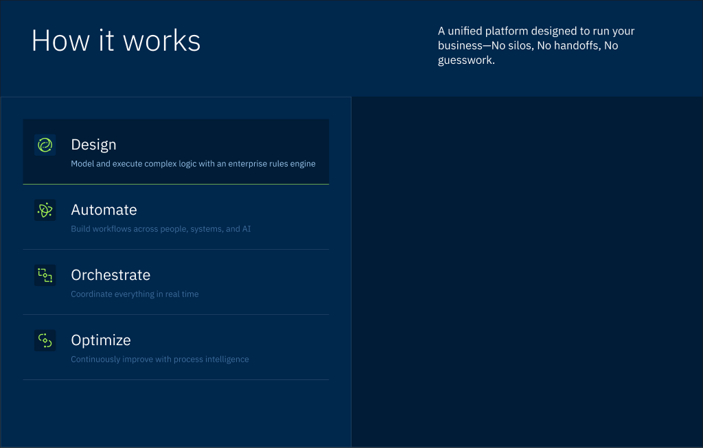

# Platform — Section 5 — How it works (auto-switching cards)

**Section nodeId (Figma):** `Kd4MoDaQreiazP75Ujy8kt:7908:130564`
**Block type rendered:** `block.featureGrid` (cols=2, auto-switching) — same metaphor as Homepage Section 8
**Site URL:** `http://localhost:3000/new-project-platform` (scroll to ~y=5600px, h=556)
**Date measured:** `2026-04-25`

## Site (rendered) — measured

| Element | Family | Size | Weight | Color | Notes |
|---|---|---|---|---|---|
| Heading "How it works" | IBM Plex Sans | 30px | 400 | rgb(255,255,255) (inverse) | `<h2>` `text-h2 font-normal` |
| Subheading | IBM Plex Sans | 20px | 400 | rgba(31,41,55,0.8) | recurring `--color-secondary` resolution |
| Tab title (Design/Automate/...) | IBM Plex Sans | 20px | 400 | white | `<h3>` `text-h4 font-normal` — but tabs render as concatenated string in `<button>` text |
| Tab description | IBM Plex Sans | 14px | 400 | rgba(31,41,55,0.8) | `text-small text-[var(--color-secondary)]` |
| Tab buttons (4) | IBM Plex Sans | 16px | 400 | white text | active bg `rgb(245,245,247)` (light gray); inactive bg transparent |
| Section bg | — | — | — | transparent (per `findBg`) | parent has Navy bg (text white) |
| Section padding | — | — | — | — | `16px 0px` (py-4) |

```json
{
  "sectionBoundsAbs": {"y": 5600, "width": 1920, "height": 556},
  "sectionCls": "relative py-4",
  "sectionBgChain": {"el": "body", "bg": "rgba(0, 0, 0, 0)"},
  "sectionPadding": "16px 0px",
  "headings": [
    {"tag": "h2", "fontSize": "30px", "fontWeight": "400", "color": "rgb(255, 255, 255)", "text": "How it works"},
    {"tag": "h3", "fontSize": "20px", "fontWeight": "400", "color": "rgb(255, 255, 255)", "text": "Design"},
    {"tag": "h3", "fontSize": "20px", "fontWeight": "400", "color": "rgb(255, 255, 255)", "text": "Automate"},
    {"tag": "h3", "fontSize": "20px", "fontWeight": "400", "color": "rgb(255, 255, 255)", "text": "Orchestrate"},
    {"tag": "h3", "fontSize": "20px", "fontWeight": "400", "color": "rgb(255, 255, 255)", "text": "Optimize"}
  ],
  "paragraphs": [
    {"fontSize": "20px", "color": "rgba(31, 41, 55, 0.8)", "text": "A unified platform designed to run your business..."},
    {"fontSize": "14px", "cls": "text-small text-[var(--color-secondary)]", "color": "rgba(31, 41, 55, 0.8)", "text": "Model and execute complex logic..."}
  ],
  "buttons": [
    {"backgroundColor": "rgb(245, 245, 247)", "color": "rgb(255, 255, 255)", "text": "DesignModel and execute complex logic..."},
    {"backgroundColor": "rgba(0, 0, 0, 0)", "color": "rgb(255, 255, 255)", "text": "AutomateBuild workflows..."},
    {"text": "OrchestrateCoordinate everything..."},
    {"text": "OptimizeContinuously improve..."}
  ],
  "imageCount": 0,
  "interactiveCount": 0
}
```

## Design (Figma) — measured via drill-in

(Source: parent `7908:130564` exceeded; metadata exceeded; drilled to children. Header `7908:130565` direct; Grid `7908:130571` metadata parsed → 2 children: Card-left `7908:130572` ✓, Card-right `7908:130601` exceeded → screenshot.)

**Header** (`7908:130565`, inverse Navy bg):
| Element | Family | Size | Weight | Color | Notes |
|---|---|---|---|---|---|
| Heading | IBM Plex Sans | 64px (Heading/H1) | 300 (Light) | `#FAFAFA` (Dark/Text/Default) | leading 1.1, w-800 |
| Subheading | IBM Plex Sans | 24px (Heading/H4) | 400 (Regular) | `#FAFAFA` | leading 1.3, w-500 right-aligned |
| Padding | — | — | — | — | `pb-64 pt-48 px-64` |

**Card-left — list of tabs** (`7908:130572`, `border #2b4b6b p-[48px]`):
| Element | Family | Size | Weight | Color | Notes |
|---|---|---|---|---|---|
| Active tab bg | — | — | — | `#001c36` (deeper Navy) | + bottom border `--primary` lime green `#a6f252` |
| Inactive tab bg | — | — | — | transparent | + bottom border `#2b4b6b` |
| Tab title | IBM Plex Sans | 32px (Heading/H3) | 400 (Regular) | `#FAFAFA` | |
| Active description | IBM Plex Sans | 18px (Heading/H5) | 400 | `#9ac4ec` (light periwinkle on Navy) | |
| Inactive description | IBM Plex Sans | 18px (H5) | 400 | `#3d6c9a` (dim navy) | |
| Icon | — | — | — | bg `#00274d` Navy, rounded-4, size 46 | 32px IBM-style monoline icons inside |
| Tab padding | — | — | — | — | `px-24 py-32`, `gap-32` |

**Card-right — featured image area** (`7908:130601`, exceeded — composed graphic, see screenshot):
- Per principle 3: should be a composed PNG asset, one per active tab (4 states).
- Currently shows blank Navy in Figma screenshot (likely the graphic for "Design" state).



## Diff — site vs design

### Critical (visibly wrong, must fix)

| Element | Site | Design | Delta | Root cause / layer |
|---|---|---|---|---|
| Heading size | 30px | 64px (H1) | −34px / −53% | Token + Primitive |
| Heading weight | 400 | 300 (Light) | weight off | Primitive |
| Subheading size | 20px | 24px | −4px | Token H4 mapping |
| Subheading color | `rgba(31,41,55,0.8)` | `#FAFAFA` | wrong base on inverse | Token — `--color-secondary` resolves to gray on inverse-tone section |
| Tab title size | 20px (rendered as h3) | 32px (H3) | −12px | Primitive — `<Heading>`/`text-h4` wrong mapping |
| Tab title weight | 400 | 400 | match | ✓ |
| Tab description size | 14px | 18px (H5) | −4px | Token / primitive |
| Tab description color (inactive) | `rgba(31,41,55,0.8)` | `#3d6c9a` | wrong tone | Token (no Navy-dim variant) |
| Tab description color (active) | same as inactive | `#9ac4ec` | active state metaphor missing | Block — no per-state color |
| Active tab bg | `rgb(245,245,247)` light gray | `#001c36` (deeper Navy) | tone-flip wrong | **Block** — active state tone wrong, same gap as Homepage Section 8 PoC |
| Active tab accent border | none | bottom `border-[var(--primary)]` lime `#a6f252` | accent missing | Block |
| Tab icons | absent (`imageCount: 0`) | 4 navy-rounded icon boxes per tab | icons missing | Schema/content |
| Featured-image right col | absent | composed graphic (one per active tab state) | **DOMINANT visual mass missing** | Block + Schema/content |
| Tab text concatenated | `"DesignModel and execute..."` | separate `<p>` title + `<p>` description | structural | Block — tab item template doesn't separate title from description |
| Card chrome (border + p-48 outer) | absent | `border #2b4b6b p-[48px]` | structural | Block |
| Section padding | `16px 0px` (py-4) | header `pb-64 pt-48 px-64` + grid h-748 | dramatically thin | Block |

### Secondary (small drift)

| Element | Site | Design | Notes |
|---|---|---|---|
| Heading split-row (heading left + subheading right) | likely single col | split-row | Layout |
| `<button>` text shows concatenated title+desc | concatenated string | wrapped `<p>` elements | Block |

## Rubric scoring (this section)

| # | Check | Result | Evidence |
|---|---|---|---|
| 1 | Layout structure | ✗ | List+image two-card grid metaphor present but badly broken; right featured-image col absent |
| 2 | Typography — size | ✗ | Heading 30 vs 64; tab title 20 vs 32; descriptions 14 vs 18 |
| 3 | Typography — weight/family | ✗ | Heading weight 400 vs 300 (Light) |
| 4 | Color | ✗ | Active tab bg light gray vs deep Navy; description colors wrong on inverse |
| 5 | Spacing | ✗ | py-4 vs pb-64 pt-48 px-64 + p-48 inside grid |
| 6 | Content present | ✗ | 4 tab icons absent; right-side featured graphic absent |
| 7 | Affordance | ⚠ | 4 buttons present (clicks tabs) — but active-state visual cue (lime accent) absent so functionally hard to tell which is active |

**Score:** `0/7` (strict) or `1/7` (generous if affordance-present counts as ✓ since clickability exists). **Section pass:** ✗.

## Gap categorization (this section)

- **Token-level:**
  - `--color-secondary` resolves to gray on inverse — recurring (12+/14 sections).
  - Heading-token-name collision: `text-h{n}` < design Heading/H{n} — recurring.
  - **NEW:** No "deeper Navy" / Navy-dim color variants. Design uses `#001c36` (deeper than `#00274d` Navy) for active card bg, `#9ac4ec` (light periwinkle) for active descriptions on Navy, `#3d6c9a` (dim navy) for inactive descriptions, `#2b4b6b` for borders. None of these likely exist in `theme.css` — would need to add as Navy-tone scale or convert to opacity-based variants.
- **Primitive-level:**
  - `<Heading>` no `weight` / no Display/64 (recurring).
  - **NEW:** `<Tabs>` or auto-switching list primitive missing active-state accent (`border-b-[var(--primary)]`). Same gap as Homepage Section 8 (PoC).
- **Block-level:**
  - `block.featureGrid` (auto-switching variant) doesn't render featured-image right col content.
  - Tab item template concatenates title+description into a single text node.
  - Card chrome `border + p-48` outer wrapper absent.
- **Schema/content-level:**
  - Tab icons not seeded (4 icon assets missing).
  - Featured image per-state graphics not seeded (4 image assets missing — composed graphics per principle 3).

## Notes / surprises

- **Direct parallel of Homepage Section 8** (also auto-switching cards, `7876:51954`). Same primitive metaphor wrong (active-state metaphor light-gray vs deep Navy + lime accent). Same featured-image right col absent. Score lands same: 0–1/7. Confirms session 2-extension prediction that REUSE-pattern Platform sections repeat Homepage gaps.
- **The "deeper Navy" variants on Card 1 active state** are notable — design uses 4 distinct Navy-family colors (`#00274d`, `#001c36`, `#2b4b6b`, `#3d6c9a`, `#9ac4ec`) for hierarchy on inverse. This is an additional token need not flagged before; Homepage Section 8 PoC was on a lighter-toned section so didn't expose it. Should be added to the token-level gap list.
- **Section is on inverse Navy bg, but `findBg` reports transparent / body.** Likely the bg is on a parent `<main>` or wrapper between section and body. Site rendered text colors confirm inverse styling (white headings, white tab text). Doesn't change the score but worth noting that `findBg` may need to walk past `<section>` boundary to fully reflect intent.
- **Tab title size (rendered) = 20px = `text-h4`.** But tab title is the design's H3 (32px). The block is using `text-h4` for tab titles — wrong. Should be at least `text-h3` (24px in current theme — still smaller than design's 32) or after token-name fix, design's H3.
- Per-state featured graphic is a critical block-level content gap. Even if other gaps fix, the right column will still be empty without 4 graphics seeded.
